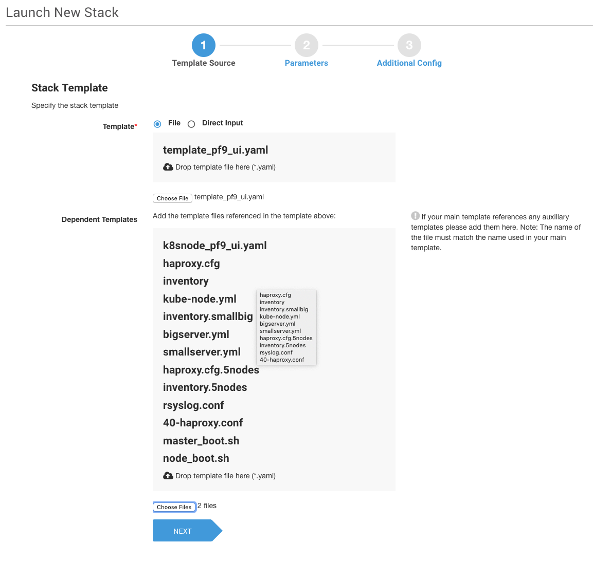
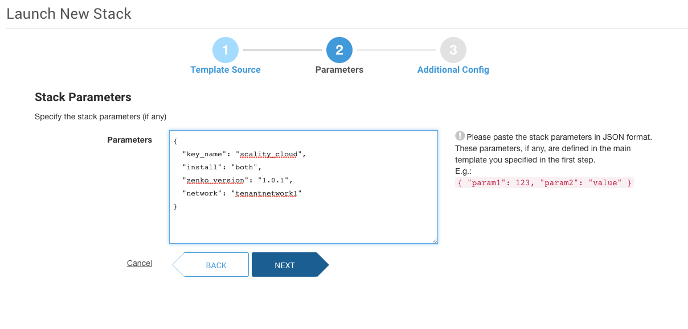
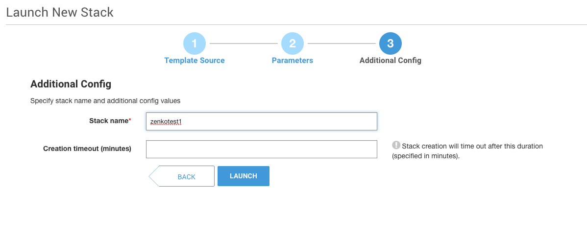

# zenko-heat-templates
This repository contains a heat template to deploy Zenko on MetalK8s on an OpenStack cloud. It also comes with a way to create a murano app package.
The Stack/Application deploys the required minimum system to run Zenko. By default, it does not deploy anything else than the instances, but it can be configured to install Metalk8s only, or Metalk8s And Zenko.

# Heat template parameters
- **key_name**<br>
  Description: Keypair to enable SSH access to the instances.<br>

- **metalk8s_version**<br>
  Description: MetalK8s version to install (only use master if you know what you're doing :)<br>
  default: "1.0.0"<br>
  Allowed_pattern: "(master|1.[0-9].[0-9](-(RC|rc|alpha|beta)[0-9])?)"<br>
  
- **install**<br>
  Description: Should we deploy anything on the cluster?<br>
  default: "none"<br>
  Allowed_values:<br>
       - none<br>
       - metalk8sonly<br>
       - both<br>
- **zenko_version**<br>
  Description: Zenko version to install<br>
  Default: "1.0.1"<br>
  Allowed_pattern: "(master|1.[0-9].[0-9](-(RC|rc|alpha|beta)[0-9])?)"<br>

- **network**<br>
  Description: Name or ID of network to create VMs on.


# CLI Usage
This assumes that you have a functioning environment with openstack CLI tool able to run against your openstack environment.</br>

## Deploying the template only
```openstack stack create --parameter key_name=<key_to_use> --parameter network=<network> -t template.yaml <stackname>```

## Deploying the template and metalk8s only
```openstack stack create --parameter key_name=<key_to_use> --parameter install=metalk8sonly --parameter zenko_version=1.0.1 --parameter network=<network> -t template.yaml <stackname>```

## Deploying the full stack (instances, metalk8s and Zenko)
```openstack stack create --parameter key_name=<key_to_use> --parameter install=both --parameter zenko_version=1.0.1 --parameter network=<network> -t template.yaml <stackname>```

# PF9 UI Usage<br>
In the platform 9 UI, this template can be deployed using the orchestration tab, and by supplying the template_pf9_ui.yaml and k8snode_pf9_ui.yaml file and all the files in templates/ and scripts/ directories.<br>
<br>
When asked about parameters, this JSON, filled in with the right data for your setup, should be used to deploy and install both metalk8s 1.0.0 and Zenko 1.0.1<br>
```{
  "key_name": "<key_to_use",
  "install": "both",
  "zenko_version": "1.0.1",
  "network": "<network>"
}
```
<br>
<br>
# Murano Packages
The included script, *create-nurano-package.sh*, will generate a zip file that can be used to deploy the stack as well. the Platform9 UI allows creating applications based on murano packages, which can then be used to deploy zenko/metalk8s as an application tby all yourauthorized platform9 users.